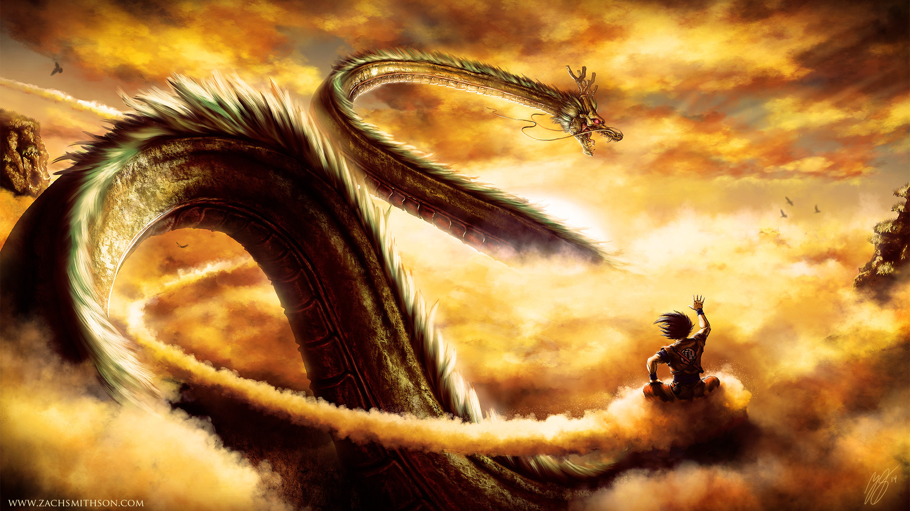
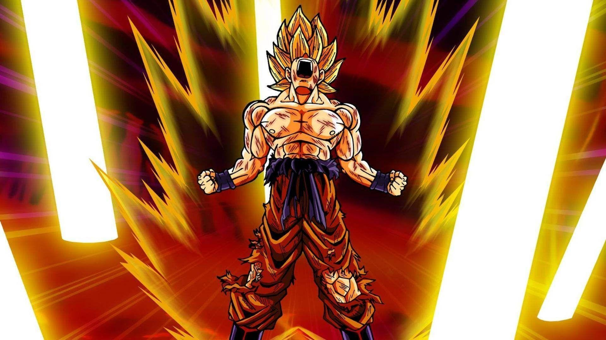
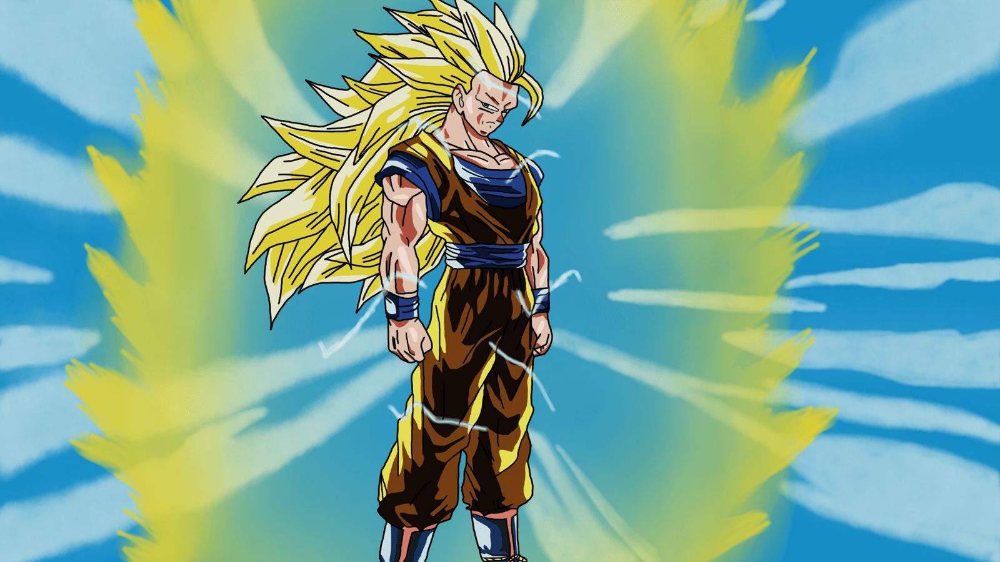
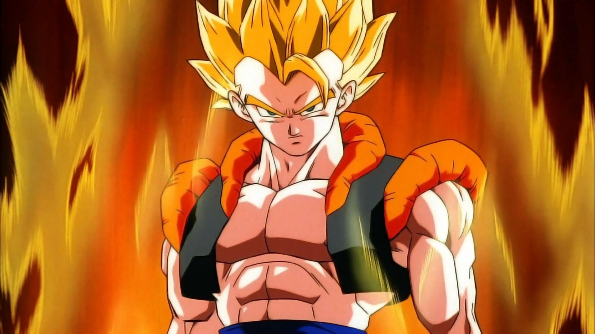
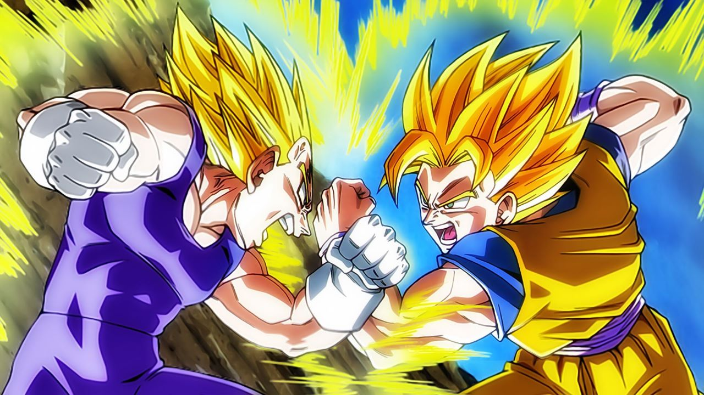
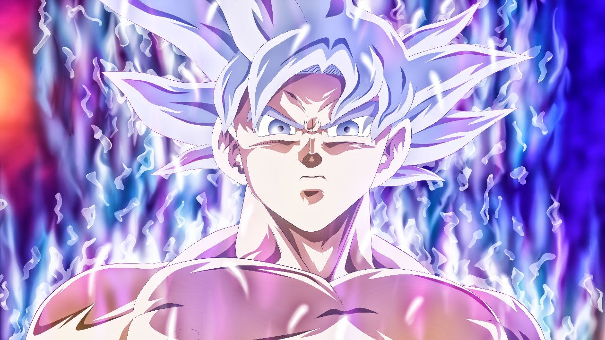

# FlexBox

# Code

## html:

```html
<!DOCTYPE html>
<html lang="en">
<head>
    <meta charset="UTF-8">
    <meta name="viewport" content="width=device-width, initial-scale=1.0">
    <title>Anime Wallpapers</title>
    <link rel="stylesheet" href="styles.css">
</head>
<body>
    <header class="header">
        <div class="logo">Anime Wallpapers</div>
        <nav class="nav">
            <ul class="nav-list">
                <li><a href="#">Home</a></li>
                <li><a href="#">Category</a></li>
                <li><a href="#">Blog</a></li>
                <li><a href="#">Contact</a></li>
            </ul>
        </nav>
    </header>
    <main class="main-content">
        <section class="hero">
            <h1>Dragon Ball</h1>
            <p>From Z to Super</p>
            <button>Explore More</button>
        </section>
        <div class="content-wrapper">
            <section class="content">
                <div class="card">
                    <h2><center>Goku on Shenron</center></h2>
                    
                    <p>Goku riding Shenron, the mystical dragon from the Dragon Ball series, is one of the most iconic images for fans of the anime and manga.This imagery combines two of the most powerful beings from the series—Goku, the Saiyan warrior with a pure heart, and Shenron, the magical dragon who can grant wishes.</p>
                </div>
                <div class="card">
                    <h2><center>Super Saiyan</center></h2>
                    
                    <p>Goku’s first transformation into a Super Saiyan is one of the most iconic moments in anime history, occurring during the Frieza Saga in Dragon Ball Z. This scene is pivotal, marking a turning point in both the series and Goku’s character development.</p>
                </div>
                <div class="card">
                    <h2><center>Super Saiyan 3</center></h2>
                    
                    <p>Goku first transforms into Super Saiyan 3 during his battle against Majin Buu in Dragon Ball Z Episode 256, "Mighty Blast of Rage." In this form, his hair grows extremely long, his eyebrows disappear, and his aura becomes intense and fiery. Super Saiyan 3 greatly boosts his power and speed but is highly energy-draining. Despite initially overpowering Majin Buu, Goku struggles to maintain the form due to its immense energy requirements.</p>
                </div>
                <div class="card">
                    <h2><center>Gogeta</center></h2>
                    
                    <p>Gogeta is a powerful fusion character in Dragon Ball, created when Goku and Vegeta perform the Fusion Dance. Combining Goku’s cheerful demeanor with Vegeta’s seriousness, Gogeta is an immensely strong fighter with a distinctive appearance and enhanced abilities. Notable for his appearances in Dragon Ball Z: Fusion Reborn and Dragon Ball Super: Broly, Gogeta showcases the combined might and skills of both Saiyan warriors, making him a formidable opponent in battle.</p>
                </div>
                <div class="card">
                    <h2><center>Goku and Vegeta</center></h2>
                    
                    <p>
                        Goku and Vegeta are iconic characters in Dragon Ball. Goku, the series' main protagonist, is a cheerful and powerful Saiyan known for his relentless drive to improve and protect his friends. Vegeta, the Prince of the Saiyan race, starts as a rival but grows into an ally, known for his pride and fierce combat skills. Their dynamic evolves from fierce competition to mutual respect, with their combined efforts often pivotal in saving the universe.</p>
                </div>
                <div class="card">
                    <h2><center>Mastered Ulta Instinct</center></h2>
                    
                    <p>Mastered Ultra Instinct is a powerful transformation in Dragon Ball Super characterized by Goku’s complete mastery over the Ultra Instinct state. This form allows Goku to react instinctively to attacks without the need for conscious thought, making his movements and reflexes incredibly fast and precise. His appearance features silver hair and eyes, with an intense, shimmering aura.Mastered Ultra Instinct grants Goku exceptional speed, agility, and power, making him nearly unbeatable in combat. </p>
                </div>
            </section>
        </div>
    </main>
    <footer class="footer">
        <p>&copy; 2024 Anime Wallpapers. All rights reserved.</p>
    </footer>
</body>
</html>
```

## CSS:

```css
* {
    margin: 0;
    padding: 0;
    box-sizing: border-box;
    font-family: 'Arial', sans-serif;
}
body {
    line-height: 1.5;
    color: red;
}
.header {
    display: flex;
    justify-content: space-between;
    align-items: center;
    padding: 1.5rem 2rem;
    background-color: red;
    color: black;
}
.logo {
    font-size: 1.8rem;
    font-weight: bold;
}
.nav-list {
    list-style: none;
    display: flex;
}
.nav-list li {
    margin-left: 1.5rem;
}
.nav-list li a {
    color: black;
    text-decoration: none;
    font-weight: 600;
}
.main-content {
    display: flex;
    flex-direction: column;
    align-items: center;
    padding: 2rem;
}
.hero {
    text-align: center;
    background: orange;
    color: black;
    padding: 4rem;
    width: 100%;
    margin-bottom: 2rem;
}
.hero h1 {
    font-size: 2.5rem;
    margin-bottom: 1rem;
}
.hero p {
    font-size: 1.2rem;
    margin-bottom: 2rem;
}
.hero button {
    padding: 0.8rem 1.5rem;
    border: none;
    background-color: red;
    color: black;
    font-size: 1rem;
    cursor: pointer;
    transition: background 0.3s ease;
}
.hero button:hover {
    background-color: red;
}
.content-wrapper {
    display: flex;
    width: 100%;
    max-width: 1200px;
}
.content {
    display: flex;
    flex: 3;
    gap: 2rem;
    flex-wrap: wrap;
    padding: 1rem;
}
.card {
    flex: 1 1 calc(33.333% - 2rem);
    background-color: orange;
    padding: 1.5rem;
    box-shadow: 0 4px 6px rgba(0,0,0,0.1);
    margin-bottom: 2rem;
    border-radius: 5px;
    transition: transform 0.3s ease, box-shadow 0.3s ease;
}
.card:hover {
    transform: translateY(-10px);
    box-shadow: 0 6px 8px rgba(0,0,0,0.15);
}
.card img {
    max-width: 100%;
    border-radius: 5px;
}
.footer {
    background-color: red;
    color: black;
    text-align: center;
    padding: 1.5rem;
    margin-top: 2rem;
    width: 100%;
}
@media (max-width: 768px) {
    .content-wrapper {
        flex-direction: column;
        align-items: center;
    }
    .content {
        flex-direction: column;
        align-items: center;
    }
    .card {
        flex: 1 1 100%;
        max-width: 100%;
    }
}